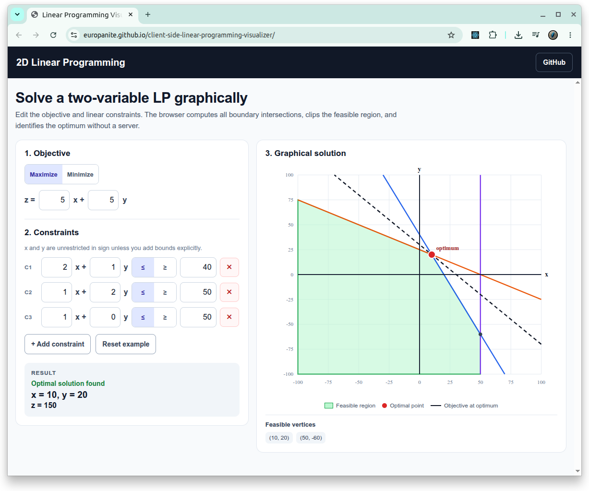

# [2D Linear Programming Visualizer](https://github.com/europanite/client-side-linear-programming-visualizer "2D Linear Programming Visualizer")

[](https://github.com/europanite/client-side-linear-programming-visualizer/actions/workflows/ci.yml)
[](https://github.com/europanite/client-side-linear-programming-visualizer/actions/workflows/deploy-pages.yml)



A client-side graphical solver for two-variable linear programming problems, built with Expo / React Native Web.

## Features

- Maximize or minimize `z = c₁x + c₂y`
- Add and remove linear constraints of the form `ax + by ≤ c` or `ax + by ≥ c`
- Draws every constraint line and the feasible region
- Enumerates feasible corner points
- Draws the objective line at the optimum
- Detects infeasible and unbounded problems

## Run locally

```bash
cd frontend/app
npm install
npm run web
```

Or with Docker:

```bash
docker compose build
docker compose up
```


## Test

```bash
cd frontend/app
npm install
npm test -- --runInBand
npm run typecheck
```

## How the solver works

1. Converts all inequalities to half-planes.
2. Intersects pairs of boundary lines, including the non-negativity boundaries.
3. Keeps only feasible intersections as candidate vertices.
4. Evaluates the objective at each vertex.
5. Checks the recession cone to distinguish a bounded optimum from an unbounded objective.
6. Clips a plotting rectangle by all half-planes to display the feasible region.

## License

- Apache-2.0
